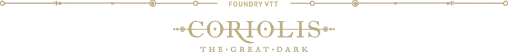

# Coriolis: The Great Dark System

The OFFICIAL system for playing Coriolis: The Great Dark on Foundry VTT.
This system provides character sheets and items for your play, if you would like to have tables and other pre-made official content check out the offical core ruleset Module - https://freeleaguepublishing.com/shop/coriolis/

 
<!--

  
  
  
  
  
  
  

-->

> The **OFFICIAL** game system for the **Coriolis: The Great Dark** on Foundry VTT!

# 📦 What's in the Box?

The core system features no content. It only provides support for various mechanics required to play the game:

- Dice roller
- Actor sheets:
  - Explorer
  - Crew
    - Bird
    - Rover
    - Shuttle
  - NPC
- Item sheets:
  - Talent
  - Armor
  - Weapon
  - Explosive
  - Vehicle Upgrade

# 🚀 Install

## System

> **Note**: The game system is compatible with Foundry **V13**.

1. Go to the setup page in Foundry and choose `Game Systems`
2. Click the `Install System` and search for "Coriolis: The Great Dark", or paste in this [manifest link](https://github.com/hodpub/coriolis-tgd/releases/latest/download/system.json)
3. Create a `Game World` using the Coriolis: The Great Dark system and start it
4. Read the _Game System's Manual_ Journal Entry in the system's compedium
5. _Enjoy!_

## Premium Modules

> **Note**: Premium modules are not mandatory to play the game as the game system is free to use, but they will save you _weeks_ of preparation.

1. Get the premium modules at the [Free League's shop](https://freeleaguepublishing.com/en/store/?collection_id=405939749122)
2. Retrieve your codes in your mail box _(contact Free League if you did not recieve anything after 15 minutes, also check your spam box)_
3. Activate the codes in your Foundry account: visit [foundryvtt.com](https://foundryvtt.com/), go to your account settings, in _"Purchased Content"_, and paste in the codes
4. Launch the Foundry client _(and make sure you have updated Foundry to V13)_
5. Install the Coriolis: The Great Dark premium modules and some of the recommended third-party modules _(optional, see below)_
6. Create a new World with the Coriolis: The Great Dark system and start it
7. In the options, activate the modules
8. Refresh and import the content. _Have fun!_

# 🧩 Supported Modules

List of modules confirmed to be stable with the Coriolis: The Great Dark game system.

- [Dice So Nice](https://foundryvtt.com/packages/dice-so-nice/)
- [Year Zero Engine: Combat](https://foundryvtt.com/packages/yze-combat)
- [Quick Insert - Search Widget](https://foundryvtt.com/packages/quick-insert)
<!-- - [Simultaneous Cards](https://foundryvtt.com/packages/simultaneous-cards) -->

<!-- # 🛠️ Contributing

If you want to contribute to the project, download and build it for something else, or if you simply have an issue, please read [our contributing guide](https://github.com/hodpub/coriolis-tgd/blob/main/CONTRIBUTING.md) to learn more about how we accept contributions and how to set up the development version of the project. -->

<!-- ## Translations

 -->

# 👤 Author

  <a href="https://hodpub.com" target="_blank">
    
     
    Hod Publishing - https://hodpub.com
  </a>

# 🔗 See Also

<!-- - [Blade Runner - The Roleplaying Game](https://bladerunner-rpg.com/)
- [Free League Publishing: Blade Runner](https://freeleaguepublishing.com/en/games/blade-runner/) -->
- [Hod Publishing](https://hodpub.com)
- [Foundry VTT](https://foundryvtt.com/)
- Discord:
  - [The Foundry](https://discord.gg/foundryvtt)
  - [Year Zero Worlds](https://discord.gg/RnaydHR)

# 📜 List of Changes

See the [changelog](https://github.com/hodpub/coriolis-tgd/blob/master/CHANGELOG.md#changelog) for a complete list of changes applied to the system.

# 📝 Licenses

<!--
- **Content & Logo:** [Blade Runner - The Roleplaying Game](https://freeleaguepublishing.com/en/games/blade-runner/) is © 2022 Alcon Entertainment, LLC. All rights reserved. The parts of this project protected under this copyright may not be distributed commercially or freely. This includes art, logo, and copyright text.

-->
- **Source Code:** All source code _(javascript, hbs, scss, as well as system templates and the like)_ are Copyright © 2025 [Hod Publishing](https://hodpub.com), and licenced under the [GNU General Public License v3.0](https://github.com/hodpub/coriolis-tgd/blob/master/LICENSE).
- **Foundry VTT:** The project is created following the Foundry VTT [Limited License Agreement for module development](https://foundryvtt.com/article/license/).
- **Icons:** Icons in the `.static/assets/icons/` folder are courtesy of [Game-icons.net](https://game-icons.net/) and licenced under [CC BY 3.0](https://creativecommons.org/licenses/by/3.0/).
- **Fonts:** The fonts used in this project carry their own licences.
